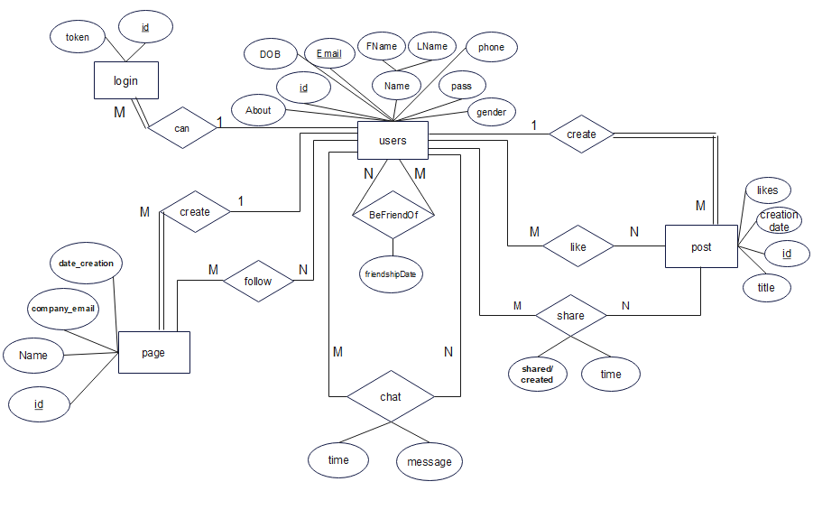
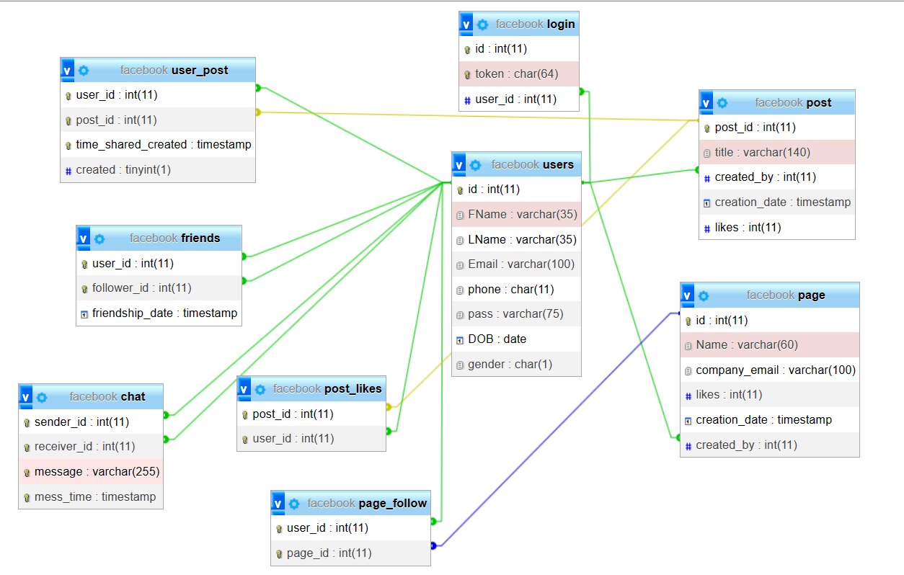

# Social Media

## Overview

This project is a social media platform built using PHP and MySQL. It allows users to create accounts, connect with friends, share posts, and interact with each other's content.

## Features

- **User Sign Up/Login::** Create a new account or log in with existing credentials..
- **Friend Connections:** Users can follow another users and see their posts on main page.
- **Post Sharing:** Users can create posts, like posts, and view posts from friends.
- **Chat with friends:** Users can send messages for friends.

## Technologies Used

- **Backend:** PHP
- **Database:** MySQL
- **Frontend:** HTML, CSS

## Database Design

### 1. **ERD**

### 2. **Schema**

